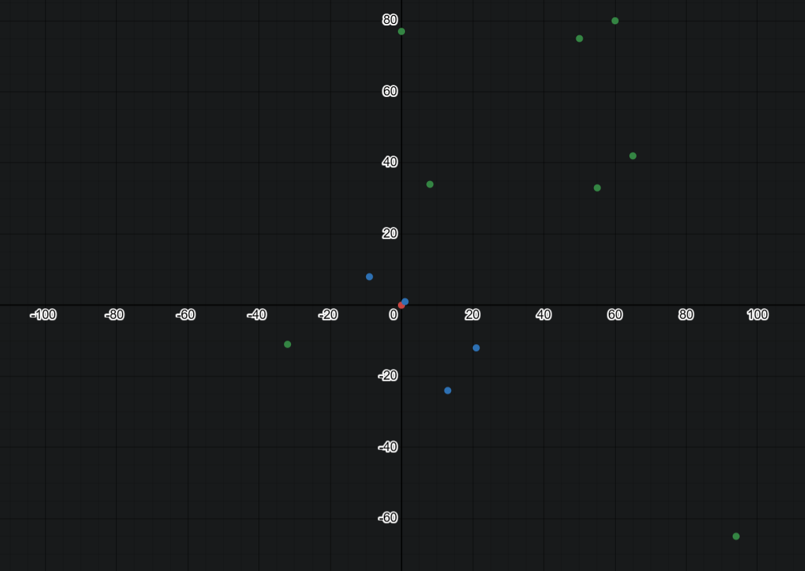

# Nearest neighbors search (NNS) and inverse distance weighted (IDW) interpolation

**Поиск ближайших соседей** для точки на плоскости или в пространстве (используется k-мерное дерево) и вычисление её значения по ним **интерполяцией с обратным взвешенным расстоянием** (метод Шепарда).

Изначально проект планировался как коммерческий, но вот он в общем доступе. Когда закончился энтузиазм, тогда закончился и проект, поэтому есть некоторые недоделки, например, можно было бы добавить интерфейс `Item` для элементов, хранящихся в узлах дерева, но это неточно. Проект может быть интересен студентам технических специальностей.

[Техническое задание](doc/tasks.pdf).

Отдельно отмечу, что реализация в меру проста с математической точки зрения (речь не про доступность для понимания, а про невысокую эффективность по причине отсутствия оптимизации используемых алгоритмов) и избыточна с программной (имеется в виду, что есть код, который приведён для примера того, как нужно реализовывать тот или иной функционал, а у применённых решение есть более простые аналоги). Нужно понимать, что это скорее обучающий проект, так как существует множество высокоэффективных решений для поставленной задачи, а этот проект писался на голом энтузиазме в ограниченные сроки с использованием ограниченных ресурсов, однако его применение в реальных условиях вполне возможно.

**Проект находится в разработке.**

## Сборка

Проект написан в Vsual Studio 2022 под Windows, конфигурации Debug и Release настроены только для платформы x64.

Также есть возможность собрать проект с помощью CMake под Linux или Windows, в директории с файлом `CMakeLists.txt`:

    mkdir build
    cd build
    cmake ..
    cmake --build .
    
Проект разрабатывался под стандарт `C++20`, но в итоге из него используется только `requires clauses` в шаблонном классе `Point`, пару раз атрибут `[[unlikely]]` в реализациях метода Шепарда, а также плейсхолдер `auto` в качестве типа аргумента `node` статической функции-члена `compareLess()` вложенного класса `Node` класса `KdTree` (т.е. применён `abbreviated function template`), поэтому понизить требование до `C++17` не составит проблем, если это нужно. Была попытка предоставить возможность сборки под стандарт `C++11` с помощью директив препроцессора (условной компиляции) в том же классе `Point`, но найти объективных причин для этого я не смог и поэтому не стал продолжать.

При сбокре я **настоятельно рекомендую использовать макрос `ZERO_DISTANCE_HANDLING`**, который определяет поведение реализаций (в двух местах в коде) метода обратных взвешенных расстояний (ОВР) при нахождении точек расположенных "бесконечно" близко друг к другу, а именно, считать ли их одной и той же точкой, завершая на этом интерполяцию, или всё же разными точками и продолжать. Без этого макроса это будет уже не метод Шепарда.

Макрос `ALLOW_DUPLICATE_POINTS`, наоборот, использовать при сборке я **крайне не рекомендую**. Если он <ins>не</ins> определён, то при вставке новой точки в дерево выполняется проверка на совпадение координат по всем осям с уже имеющимися точками, встречающимися на пути от корня к вершине при поиске места для вставки. При этом, задав значение `true` переменной `update` метода `insert()`, который и выполняет вставку, можно обновить значение, если точки совпали. Если же оговоренный макрос опредёл, то такой проверки выполняться не будет и в дереве могут появиться точки с одинаковыми координатами, однако при удалении это не будет учитываться никогда, т.е. метод `remove()` удаляет только одну первую совпавшую по всем координатам точку. Стоит отметить, что ни после вставки, ни после удаления балансировка дерева не выполняется. Оба этих метода класса `KdTree` не являются необходимыми для решения поставленной задачи.

Отладочная сборка выполняет самотестирование и выводит много полезной информации, а также сохраняет найденных ближайших соседей для каждой из искомых точек в отдельный файл с указанием полученного в результате интерполяции значения в имени.

### Описание и тестирование

Экземпляры класса `KdTree` и копируемые, и перемещаемые, несмотря на наличие `std::unique_ptr<>` для хранения данных сессии поиска - он не участвует ни в копировании, ни в перемещении. Важно отметить, что если есть активная сессия поиска, то при попытке перемещения дерево будет скопировано, а не перемещено. Это было сделано для того, чтобы класс был потокобезопасным, что не было реализовано до конца.

Экземпляры класса `NnsSessProps` и некопируемые, и неперемещаемые, потому что создаются для хранения данных сессии поиска, которые необходимы и действительны только пока этот поиск выполняется.

Класс `ConfigParams`, работающий с конфигурационным файлом, имеет значения по умолчанию для всех параметров, поэтому наличие этого файла вообще говоря необязательно, однако если его нет или его не удалось прочитать (например, нет прав), то функция `readConfig()` вернёт `false` и программа завершится с ошибкой. Тоже самое будет если файл содержит не JSON-объект или этот объект пустой (т.е. **в конфигурационном файле должен быть один и только один непустой JSON-объект**). В случае же если какой-то параметр отсутствует или он неправильный, то будет использовано значение по умолчанию и ошибки не будет. Пример конфигурационного файла есть в репозитории. Коротко о параметрах в нём:

1. `known_points_fn` - путь к файлу в формате JSON (или только имя, если он в рабочей директории), который содержит массив опорных точек (**x**, **y**, **value**), вернее, известных точек, так как опорные будут выбраны из них при поиске ближайших соседей.
2. `unknown_points_fn` - путь к файлу в формате JSON (или только имя, если он в рабочей директории), который содержит массив искомых точек (**x**, **y**), то есть точек, значения которых будут получены интерполяцией по найденным ближайшим соседям.
3. `num_neighbors` - количество ближайших соседей (опорных точек), которых сначала нужно найти/выбрать в дереве, для расчёта методом ОВР (Шепарда) значения каждой из искомых точек последовательно.
4. `reverse_search` - при обратном поиске сначала находится ближайший к заданной точке лист (терминальный узел, т.е. не имеющий дочерних узлов) в дереве, а ближайщие соседи собираются по пути обратно к корню; в большинстве случаев он будет менее эффективен, чем прямой поиск, когда ближайшие соседи собираются начиная с корня по пути к вершине дерева до достижения максимального их количества или пока разность расстояний от наиближайшего из найденных соседей до заданной точки и от заданной точки до текущей не начнёт увеличиваться (условия те же, что и при обратном поиске). По сути этот параметр задаёт приоритетную область для поиска: корень дерева, если `false`, или его вершина, если `true`.
5. `idw_power` - он же power parameter, т.е. степень, используемая в весовой функции метода ОВР (Шепарда), подробнее и доступным языком написано в [википедии](https://en.wikipedia.org/wiki/Inverse_distance_weighting).
6. `output_fn` - путь к файлу в формате JSON (или только имя, если он должен быть создан в рабочей директории), который будет содержать массив тех же искомых точек, но уже со значениями, полученными в результате интерполяции.
7. `json_indent` - аргумент функции `dump()` из библиотеки [`nlohmann / json`](https://github.com/nlohmann/json?tab=readme-ov-file#serialization--deserialization), может иметь отрицательное значение для неформатированного вывода (сериализации).

Опорные и искомые точки в файлах с входными данными должны быть JSON-объектами, а их координаты и значение - числами в понимании библиотеки `nlohmann / json` (т.е. `is_number()`). Сейчас в коде координаты - это целые числа со знаком (`int`), а значение - число с плавающей точкой двойной точности (`double`). И координаты и значение могут быть любыми арифметическими типами в понимании стандартной библиотеки C++ (т.е. `std::is_arithmetic_v<T>`). Типы координат и значения, являющиеся параметрами шаблона точки `Point<C,V>`, также являются параметрами шаблона функции `readPoints<C, V>()` для чтения входных данных, т.о. **достаточно указать типы в одном месте в коде** либо для вектора опорных точек, либо для функции их чтения из файла, т.к. они обрабатываются первыми, больше никаких действий не требуется. Помимо координат и значения для точки можно указывать всё что угодно, т.к. остальные поля JSON-объекта игнорируются, но без координат программа работать не будет вообще, а при отсутствии значения (очевидно, что это касается только опорных точек) её работа будет бессмысленна, хотя и возможна (в результате интерполяции всегда будет ноль).

`ConfigParams` - это синглтон Майерса. У него есть шаблонный метод `getParam<>()` для получения значений параметров по имени (строковому литералу). Он относительно легко масштабируется (в четырёх местах в коде: перечисление полей в теле класса, объявление кортежа и его инициализация, а также функция чтения параметров из файла), если будет необходимо добавить конфигурационные параметры. Самое важное, с точки зрения программирования, что в нём есть - имена осей (**x**, **y**) и значения (**value**), которые используются при чтении входных и записи выходных точек. **Чтобы добавить новую ось (измерение) достаточно дописать её название в массив `axis_names`.** Больше в коде никаких изменений не требуется.

Перед запуском нужно подготовить два набора точек (опорных и искомых), желательно <ins>уникальных</ins> из-за указанных выше причин, например, с помощью написанного на языке Python генератора `point_generator.py` из этого же репозитория, не забыв добавить в него новую координату, если нужно. При чтении файлов с помощью функции `readPoints()`, если макрос `ALLOW_DUPLICATE_POINTS` <ins>не</ins> определён, уникальность точек (отсутствие между ними равенства координат одновременно по всем осям) гарантируется, т.е. наборы опорных и искомых точек по отдельности будут уникальны.

Планирую добавить отрисовку результата с помощью библиотеки `gnuplot`, а пока просто вот такая картинка:

