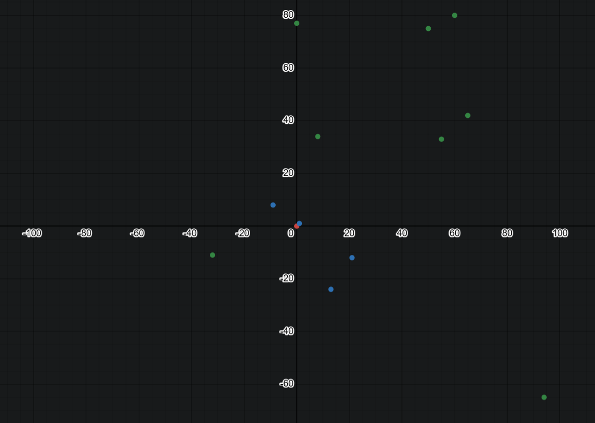

# NNs (nearest neighbors) search and IDW (inverse distance weighting) interpolation

**Поиск ближайших соседей для точки** на плоскости или в пространстве (используется k-мерное дерево) **и вычисление её значения по ним интерполяцией с взвешиванием обратных расстояний** (метод Шепарда).

Изначально проект планировался как коммерческий, но вот он в общем доступе. Когда закончился энтузиазм, тогда закончился и проект, поэтому есть некоторые недоделки. Проект может быть интересен студентам технических специальностей.

[Техническое задание](doc/tasks.pdf).

Отдельно отмечу, что реализация в меру проста с математической точки зрения (речь не про доступность для понимания, а про невысокую эффективность в виду отсутствия оптимизации используемых алгоритмов) и избыточна с программной (имеется в виду, что есть код, который приведён для примера того, как нужно реализовывать тот или иной функционал, а у применённых решение есть более простые аналоги). Нужно понимать, что это скорее обучающий проект, так как существует огромное множество высокоэффективных решений для поставленной задачи, а этот проект писался на голом энтузиазме в ограниченные сроки с использованием ограниченных ресурсов, однако его применение в реальных условиях вполне возможно.

**Проект находится в разработке.**

## Сборка

Проект написан в Vsual Studio 2022 под Windows, конфигурации Debug и Release настроены только для платформы x64.

Также есть возможность собрать проект с помощью CMake под Linux или Windows, в директории с файлом `CMakeLists.txt`:

    mkdir build
    cd build
    cmake ..
    cmake --build .
    
Проект разрабатывался под стандарт `C++20`, но по факту из него используется только `requires clauses` в шаблонном классе `Point`, поэтому понизить требование до `C++17` не составит проблем. Была попытка предоставить возможность сборки под стандарт `C++11` с помощью директив препроцессора (условной компиляции) в том же классе `Point`, но найти объективных причин для этого я не смог и поэтому не стал продолжать.

### Описание и тестирование

Класс `ConfigParams`, работающий с конфигурационным файлом, имеет значения по умолчанию для всех параметров, поэтому наличие этого файла необязательно. Пример конфигурационного файла есть в репозитории. Коротко о параметрах в нём:

1. `known_points_fn` - путь к файлу в формате JSON (или только имя, если он в рабочей директории), который содержит массив опорных точек (**x**, **y**, **value**), вернее, известных точек, так как опорные будут выбраны из них при поиске ближайших соседей.
2. `unknown_points_fn` - путь к файлу в формате JSON (или только имя, если он в рабочей директории), который содержит массив искомых точек (**x**, **y**), то есть точек, значения которых будут получены интерполяцией по найденным ближайшим соседям.
3. `max_neighbors` - максимальное количество ближайщих соседей (опорных точек), которое нужно найти/выбрать в дереве для каждой из искомых точек для последующей интерполяции.
4. `reverse_search` - при обратном поиске сначала находится ближайщий к заданной точке лист (терминальный узел, т.е. не имеющий дочерних узлов) в дереве, а ближайщие соседи собираются по пути обратно к корню; в большинстве случаев он будет менее эффективен, чем прямой поиск, когда ближайшие соседи собираются начиная с корня по пути к вершине дерева до достижения максимального их количества или пока разность расстояний от наиближайшего из найденных соседей до заданной точки и от заданной точки до текущей не начнёт увеличиваться (условия те же, что и при обратном поиске).
5. `idw_power` - он же power parameter, т.е. степень, используемая в весовой функции метода обратных взвешенных расстояний (ОВР), подробнее, но доступным языком написано в [вики](https://en.wikipedia.org/wiki/Inverse_distance_weighting).
6. `output_fn` - путь к файлу в формате JSON (или только имя, если он должен быть создан в рабочей директории), который будет содержать массив тех же искомых точек, но уже со значениями, полученными в результате интерполяции.
7. `json_indent` - аргумент функции `dump()` из библиотеки [`nlohmann / json`](https://github.com/nlohmann/json?tab=readme-ov-file#serialization--deserialization), может иметь отрицательное значение для неформатированного вывода (сериализации).

Опорные и искомые точки в файлах с входными данными должны быть JSON-объектами, а их координаты и значение - числами в понимании библиотеки `nlohmann / json` (т.е. `is_number()`). Сейчас в коде координаты - это целые числа со знаком (`int`), а значение - число с плавающей точкой двойной точности (`double`). И координаты и значение могут быть любыми арифметическими типами в понимании стандартной библиотеки C++ (т.е. `std::is_arithmetic_v<T>`). Типы координат и значения, являющиеся параметрами шаблона точки `Point<C,V>`, также являются параметрами шаблона функции `readPoints<C, V>()` для чтения входных данных, т.о. **достаточно указать типы в одном месте в коде** либо для вектора опорных точек, либо для функции их чтения из файла, т.к. они обрабатываются первыми, больше никаких действий не требуется. Помимо координат и значения для точек можно указыввать всё что угодно, т.к. остальные поля JSON-объекта игнорируются, но без **x**, **y** и **value** (для опорных точек) программа работать не будет.

`ConfigParams` - это синглтон Майерса. У него есть шаблонный метод `getParam<>()` для получения значений параметров по имени (строковому литералу). Он относительно легко масштабируется (в четырёх местах в коде: новый параметр в тело класса, в объявление кортежа и его инициализацию, а также в функцию чтения параметров из файла), если будет необходимо добавить конфигурационные параметры. Самое важное, с точки зрения программирования, что в нём есть - имена осей (**x**, **y**) и значения (**value**), которые используются при чтении входных и записи выходных точек. **Чтобы добавить новую ось (измерение) достаточно дописать её название в массив `axis_names`.** Больше в коде никаких изменений не требуется.

Перед запуском нужно сгенерировать набор точек, например, с помощью написанного на языке Python генератора `point_generator.py` из репозитория, не забыв добавить в него новую координату, если нужно.

Планирую добавить отрисовку релузьтата с помощью библиотеки `gnuplot`, а пока просто вот такая картинка:

